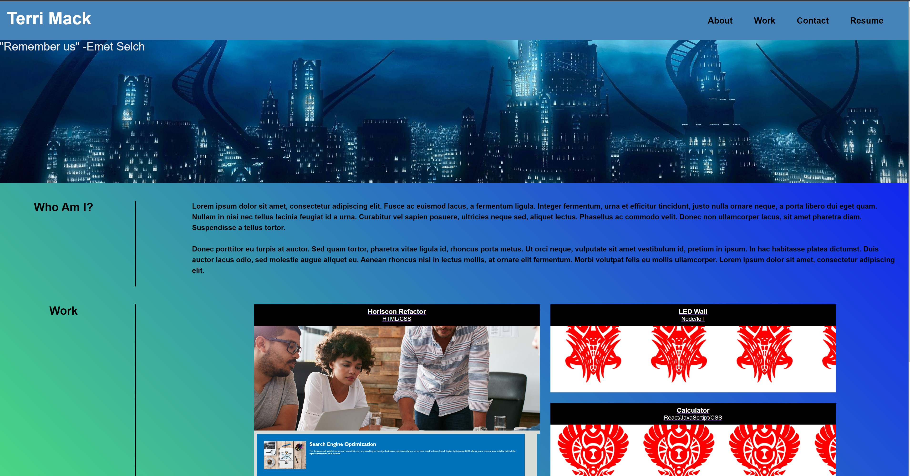

# Advanced CSS Coding Portfolio
## Using HTML and CSS
### Module 2 assignment- to create a html website from scratch using advanced css techniques.
### The criteria the portfolio needed to meet are: 
### 1. The name of developer, a photo or avatar, and a navigation bar to link to each designated section must be included.
### 2. Have the navigation bar be functional with a UI scroll.
### 3. The portfolio directory has functioning links with each listed project. 
### 4. The webpage works on various screens and devices.

 

### This portfolio goal is to be used as a "basecamp" for future projects completed. With time, the project directory will include more links to each new project or group projects done as time progresses. 

 

# Webpage Image with working link
<!-- webpage link with image -->
### Link https://terrinmack.github.io/Advanced-CSS-Portfolio/

 

# Installation 
* Created a wireframe of the general portfolio page. 
* Created a new repository on github with an html index, style.css, and reset.css.
* Through trial and error, created a general, non-stylized html page with a navigation bar at the top of the page, home section, about me, project directory, and contact me section.
    * The email is linked directly to ones defaul mail service on pc or mobile. 
* Used advanced CSS techniques learned via the UW coding bootcamp and google searches to create a more aesthetcially functional webpage. 
* Ensured that the webpage functions with multiple media queries (tablets and mobile devices). 

 

# Contact
### [Terri Mack](https://github.com/terrinmack?tab=repositories)